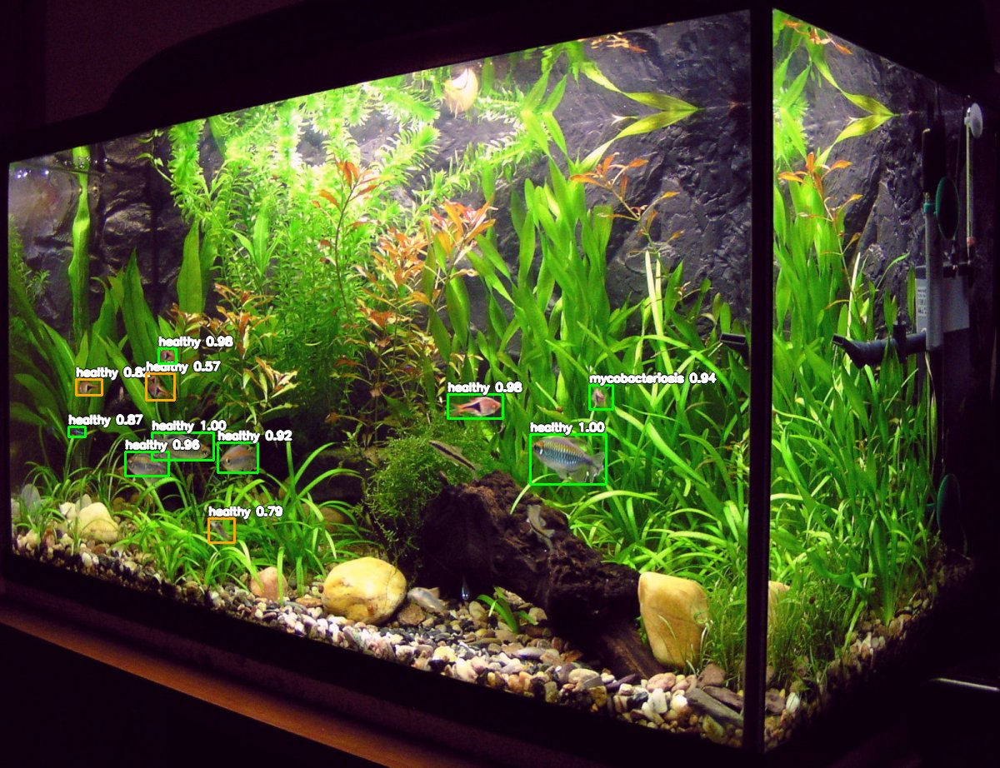
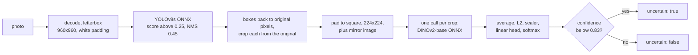
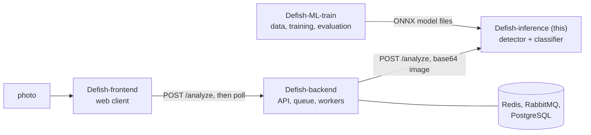

# Defish Inference Service

The model-serving part of [**Defish**](https://defish.katzer.ru/): an HTTP service that finds every fish in an aquarium photo and gives each one a disease hint with an honest "not sure" flag. A YOLOv8s detector and a frozen DINOv2 embedder with a linear head run on ONNX Runtime and NumPy only, without PyTorch or scikit-learn.

> **Not a veterinary tool.** The classifier tells seven conditions apart and was trained on 138 labelled crops: about 57% accuracy (top-3 84%), with a 95% interval of roughly ± 8 points. It reports `uncertain` instead of forcing a label when it is not confident. Treat the output as a hint, not a diagnosis.



*Real output of the whole pipeline (`POST /analyze` on a public-domain photo, 2026-10-05, real detector and real classifier, drawn by [`docs/examples/annotate.py`](docs/examples/annotate.py) `--classes`; green: confident, orange: flagged `uncertain`). Eleven fish are boxed; a few visible ones are missed, which fits the detector's known weak spot with small fish. The true condition of these fish is not known, so the picture shows what the model says, not what is true: the small fish at the middle right (a 36×39 px crop) is called `mycobacteriosis` at 0.94 and is not flagged, the kind of call the gate cannot catch, and the reason this is a hint, not a diagnosis. [Detections only](docs/media/detect-planted-tank-tetras.jpg).*

**Try it in a minute:** [Quick start](#quick-start) clones, installs, runs the 69 tests and starts the service with stand-in models, no weights needed.

## What this project demonstrates

- **Numbers that survive a leak-free test.** The detector reaches AP50 0.66 against 0.55 for the model it replaced on a test split where no tank appears on both sides (165 images, 292 fish); the classifier reaches accuracy 0.57 and top-3 0.84 over 138 crops with grouped cross-validation. Measured in `Defish-ML-train` (data not public); [Results](#results).
- **A classifier that says when it is unsure.** Predictions below a 0.83 confidence gate are flagged `uncertain`; on out-of-fold predictions the gate keeps 49% of crops at about 75% accuracy among those kept (a tuned target, not an independent measurement). [Why](docs/design-decisions.md#4-a-confidence-gate-instead-of-a-forced-label)
- **Serving without a deep-learning framework, checked against the reference.** The embedder is exported to ONNX and the head is plain arrays: ONNX Runtime and NumPy only. Run with the real files, the service reproduces the reference runtime of `Defish-ML-train` on 86 crops: same labels, confidences within 1.1e-7, no gate flag differs. It did not until the crop resize was aligned with training (confidences differed by up to 0.12, 5 labels changed) [(measured)](#classifier-cost-and-two-problems-the-real-files-showed).
- **Checked by running it.** 69 tests in about 2 seconds, with no weights needed (tiny stand-in models run the real loading and inference code); twelve deliberate regressions were each caught by a failing test. The service was also run end to end with the real weights and built and run with Docker Compose (1 min 35 s from nothing, 878 MB image). Running the original code exposed four defects (a health check that said `healthy` with both models down, red and blue swapped in `/detect`, 500 for bad input, exception text in answers); running it with the real files and in Docker exposed three more (the crop resize, a batched embedder call 1.3 to 1.9 times slower than one call per crop, secrets and weights copied into the image). All are fixed, with before/after output: [what changed](docs/design-decisions.md#changes-made-with-this-documentation-round).
- **Honest about its limits.** The weights are not in the repository, so a reader cannot reproduce the recorded outputs, the example outputs have no ground truth, and `/detect` blocks the event loop. [Limitations](#limitations).

## Contents

[Idea](#idea) · [Features](#features) · [How it works](#how-it-works) · [Results](#results) · [Quick start](#quick-start) · [Usage examples](#usage-examples) · [Configuration](#configuration) · [API](#api) · [Model files](#model-files) · [Repository layout](#repository-layout) · [Tests and quality](#tests-and-quality) · [Deployment](#deployment) · [Limitations](#limitations) · [Related repositories](#related-repositories) · [License](#license)

Further reading in `docs/`:

| File | What is there |
|---|---|
| [docs/architecture.md](docs/architecture.md) | files, one request as a sequence, coordinate frames with a worked example, every preprocessing step, the model-file contract, start-up and degraded states, concurrency, failure modes |
| [docs/design-decisions.md](docs/design-decisions.md) | nine decisions with alternatives and evidence, what was not adopted, the defects found and fixed, the known issues that were not changed |
| [docs/api.md](docs/api.md) | every route with real requests and answers, fields, error cases, what `Defish-backend` sends and reads |
| [docs/deployment.md](docs/deployment.md) | what the machine needs, running with and without Docker, production notes, upgrading, what was verified |
| [docs/examples/](docs/examples/) | stand-in model builder, probe, latency, classifier-measurement and walkthrough scripts, four CC photos, recorded transcripts (real weights, Docker, tests) |
| [docs/media/CREDITS.md](docs/media/CREDITS.md) | source, author and licence of every photograph and of the pictures made from them |

## Idea

A photo of an aquarium contains many fish, often small, partly hidden and different from each other. One classifier on the whole photo cannot say which fish looks ill, so the service works in two stages and keeps each stage honest:

1. **Find the fish, then look at each one.** A detector runs on a fixed 960×960 canvas (constant cost, no distortion); every box is mapped back and cut from the **original** photo, so a small fish keeps the detail the canvas lost.
2. **Describe, do not force.** A frozen DINOv2 embedding and a linear head are what 138 crops can support. The answer carries the top three classes and an `uncertain` flag, and a weak guess is returned rather than hidden, so the caller (a web page, an API) can show "unclear" instead of a wrong diagnosis.
3. **Keep the serving side small.** Only ONNX Runtime and NumPy at run time; the heavy training stack stays in `Defish-ML-train`.

## Features

**Detection**
- Finds fish in a photo of any size: letterbox to 960×960 with white padding, YOLOv8s on ONNX Runtime, score above 0.25, non-maximum suppression at IoU 0.45, boxes returned in pixels of the decoded photo (EXIF orientation applied). [Code](inference/detector.py), [tests](tests/test_detector.py), [coordinate frames](docs/architecture.md#coordinate-frames)
- `POST /detect` returns the boxes and a copy of the photo with the boxes drawn. [Example](#usage-examples), [reference](docs/api.md#post-detect)

**Classification**
- Every box that can be cropped gets one of seven classes (`healthy`, `fin_rot`, `dermatomycosis`, `hexamitosis`, `mycobacteriosis`, `oodiniosis`, `plistophorosis`), its probability, and the three most probable classes. [Code](inference/classifier.py), [tests](tests/test_classifier.py)
- The confidence gate: `uncertain: true` when the probability is below the threshold stored in `meta.json` (0.83). Weak calls are flagged, never dropped. [Decision](docs/design-decisions.md#4-a-confidence-gate-instead-of-a-forced-label)
- The embedder runs once per crop on the crop and its mirror image (a batch of 2): one call for all crops was measured 1.3 to 1.9 times slower with the real model and replaced ([test](tests/test_classifier.py), [measured](#classifier-cost-and-two-problems-the-real-files-showed)). Crops are resized with Pillow's bicubic filter, as in training. [Decisions](docs/design-decisions.md#5-calling-the-embedder-once-per-crop)
- `POST /analyze` does all of it in one request and also returns the decoded, upright photo and its size, so a client draws boxes on the picture the boxes belong to. [Reference](docs/api.md#post-analyze)

**Operation**
- `GET /health` says `healthy` or `degraded` and which model is missing; the detector and the classifier load independently, so `/detect` keeps working without the classifier. [Recorded](docs/examples/transcripts/fixes-before-after.txt)
- A rate limit per client address (default 60 per minute, configurable) and a 300 s timeout. Errors are short and stable: 400 for input that is not an image or not valid, 408, 429, 500 without exception text. [Failure modes](docs/architecture.md#failure-modes)
- Open CORS and no authentication: meant for a private network behind one trusted caller. [Deployment](docs/deployment.md#running-it-in-production)

**For developers**
- Stand-in models with the real file contract let the service start, and the whole test suite run, without the weights. [Builder](docs/examples/make_standin_models.py), [decision](docs/design-decisions.md#9-stand-in-models-for-tests-and-examples)
- Black-box probes of a running service, a latency script, a script that draws the returned boxes, and a curl walkthrough, all with recorded output. [Examples](docs/examples/)

## How it works



Each step, the three coordinate frames and the failure modes are in [docs/architecture.md](docs/architecture.md). The decisions and what they were chosen over:

| Decision | Short reason | Detail |
|---|---|---|
| detect at 960, classify from the original | constant cost, no distortion, small fish keep their detail | [1](docs/design-decisions.md#1-detect-on-a-fixed-canvas-classify-from-the-original) |
| frozen embedder and linear head | 138 crops cannot train a network; few parameters to overfit | [3](docs/design-decisions.md#3-a-frozen-embedder-and-a-linear-head) |
| a gate, not a forced label | 0.57 accuracy is too low to present as findings | [4](docs/design-decisions.md#4-a-confidence-gate-instead-of-a-forced-label) |
| ONNX Runtime and NumPy only | no PyTorch or scikit-learn on the server | [6](docs/design-decisions.md#6-onnx-runtime-and-numpy-only-and-the-same-preprocessing-as-training) |
| independent models, truthful health | a missing classifier must not take the detector down | [7](docs/design-decisions.md#7-two-independent-models-a-health-that-tells-the-truth) |

Tried and not adopted (in `Defish-ML-train`, summarised [here](docs/design-decisions.md#considered-and-not-adopted)): detector at 1280 px, tiled inference, self-training, BioCLIP embeddings, SAM-masked crops.

## Results

The accuracy figures come from the reports and scripts of `Defish-ML-train`; they are quoted here with their sample sizes and are **not** reproducible from this repository. From "What the detector does on four public photos" on, everything is measured here, with the real files.

**Detector** (leak-free test split, 165 images and 292 fish, production pipeline: letterbox 960, score 0.25, NMS 0.45)

| Model | AP50 | Precision | Recall | False positives per image |
|---|---|---|---|---|
| previously deployed | 0.55 | 0.69 | 0.55 | 0.44 |
| YOLOv8s, pretrained, train + validation | **0.66** | 0.73 | 0.62 | 0.40 |

The earlier model had memorised part of its data (AP50 0.74 on images from its old training split, 0.41 on unseen ones); on the 117 test images it had never seen, the new one scores 0.72 against 0.42 (95% bootstrap interval of the difference +0.23 to +0.37). Recall on fish under 64 px is about 0.3 to 0.45 (62 fish between 24 and 64 px, 30 under 24 px: noisy). The detector file used for the recordings here (it is not in the repository) carries export metadata dated 2026-09-22 and a train + validation data file, matching the second row; that it is byte-identical to the evaluated export was not checked.

**Classifier** (7 classes, 138 expert-checked crops, grouped cross-validation, 4 folds × 8 seeds)

| Approach | Accuracy | Note |
|---|---|---|
| frozen DINOv2-base embeddings + logistic regression (shipped) | **0.57 ± 0.04**, top-3 **0.84** | 95% interval about ± 8 points |
| the earlier YOLO classifier trained from scratch | 0.38 | matched split of 45 unique crops; DINOv2 + head scores 0.51 there; the intervals (0.25 to 0.52 and 0.37 to 0.65) overlap, so the size of the difference is not established |
| BioCLIP embeddings | 0.42 | not adopted |
| SAM-masked crops | 0.45 | hurts `fin_rot`: the masks clip thin fins |

A confound was found and only partly fixed: all six `plistophorosis` crops were neon tetras and the healthy class had none; five external healthy-tetra photos cut the mislabelled healthy tetras from 3 of 5 to 1 of 5 in a leave-one-out check. The other diseases were not checked for the same failure. The confidence gate (0.83 keeps 49% of crops at about 75% accuracy; the table of thresholds is in [the decision](docs/design-decisions.md#4-a-confidence-gate-instead-of-a-forced-label)) was tuned on the same out-of-fold predictions.

**What the detector does on four public photos** (measured here; there is no ground truth, so these are counts, not accuracy; [pictures](docs/media/))

| Photo | Size | Boxes | `/detect` median, ms (10 runs) |
|---|---|---|---|
| `cardinal-tetra-school.jpg` | 801×686 | 29 | 264 |
| `planted-tank-tetras.jpg` | 1600×1229 | 11 | 282 |
| `guppies-planted-tank.jpg` | 1600×1200 | **0** | 278 |
| `endler-guppies-dense-shoal.jpg` | 1600×1200 | 46 | 290 |

On `guppies-planted-tank.jpg` the detector returns nothing although three guppies are visible ([picture](docs/media/detect-guppies-planted-tank.jpg)): a miss on a whole-tank photo with small fish, one example, not a rate. Times are the wall-clock of the whole request (decoding, detection, drawing, JPEG encoding) on an AMD Ryzen 7 7435HS with ONNX Runtime's default threads, one process; [raw output](docs/examples/transcripts/latency.txt). The classifier is not in these numbers; it is the next subsection.

**What the real classifier says on the same photos** (no ground truth: the true condition of these fish is not known, so this shows what the model says, not whether it is right; [raw output](docs/examples/transcripts/analyze-summary.txt))

| Photo | Fish | `/analyze`, s | Flagged `uncertain` | Classes (count, flagged among them) |
|---|---|---|---|---|
| `cardinal-tetra-school.jpg` | 29 | 5.4 | 15 | healthy 25 (11), plistophorosis 2 (2), mycobacteriosis 2 (2) |
| `planted-tank-tetras.jpg` | 11 | 3.2 | 3 | healthy 10 (3), mycobacteriosis 1 (0) |
| `guppies-planted-tank.jpg` | 0 | 0.28 | 0 | none found |
| `endler-guppies-dense-shoal.jpg` | 46 | 12.5 | 31 | mycobacteriosis 26 (18), healthy 13 (6), plistophorosis 5 (5), dermatomycosis 1 (1), oodiniosis 1 (1) |

One request each. The dense-shoal photo (many small fish in a bright underwater-style frame) gets 26 `mycobacteriosis` calls, 8 of them confident (0.834 to 1.000); it should not be read as findings. On the tetra school (cardinal tetras, close relatives of the neon tetras of the training data), 2 of 29 are called `plistophorosis` and flagged, the disease that was perfectly correlated with neon tetras there ([confound](#results)); one photo proves nothing, but it is the failure to look for. Crop size does not decide the flag: with a longer side under 64 px, 13 of 25 crops are flagged across these photos, from 64 px up 36 of 61.

### Classifier cost, and two problems the real files showed

The classifier files reached this documentation on 2026-10-05; the measurements below use the real ones, on an AMD Ryzen 7 7435HS (16 threads), ONNX Runtime 1.23.2, one process ([raw output](docs/examples/transcripts/classifier-measurements.txt), script [`measure_classifier.py`](docs/examples/measure_classifier.py), which keeps the previous ways as options so that the comparison can be repeated).

- **Cost.** The embedder takes about 131 ms for one 224×224 image; a crop is embedded twice (itself and its mirror image), so 0.2 to 0.3 s per crop (the runs vary by up to 30 %). `/analyze` took 3.2 s for 11 fish, 5.4 s for 29 and 12.5 s for 46 (one request each); a `/detect` takes about 0.28 s ([latency](docs/examples/transcripts/latency.txt)). On a different machine, a 2-core Xeon E5-2670 VDS (AVX only, no AVX2) measured on 2026-10-06 with the real files, `/analyze` took 69.5 s for the 29-fish photo (2.4 s per fish), 35.0 s with `CLASSIFIER_TTA=0`, and 68.2 s with `CLASSIFIER_CHUNK_SIZE=8`, so on that host the crops per call made no difference, while the mirror pass halved the time. With `CLASSIFIER_TTA=0` 28 of the 29 labels and 26 of the 29 `uncertain` flags agreed with the default, and the label's confidence moved by 0.033 on average (at most 0.10); one label and three flags changed. While another container was using the CPU the same request took 173 s.
- **Problem 1, fixed: the crop resize differed from training.** The service resized crops with OpenCV's cubic interpolation; the training script (`train_final.py`) and the reference runtime of `Defish-ML-train` (`infer_onnx.py`) use Pillow's bicubic filter. On the 86 crops of the three photos with fish, the confidence of the label differed from the reference by up to 0.114, 0.120 and 0.053 (per photo), 5 labels differed (all on the dense shoal) and 4 crops changed side of the 0.83 gate. Replacing only the resize by Pillow's made the service agree with the reference on all 86 labels, with a confidence difference of at most 1.1e-7 and no gate change, so the resize was the whole difference. The service now uses Pillow's (`pillow` was already in `requirements.txt`, unused); a test pins it. Which resize is closer to the truth was not measured (no ground truth), but this one is the one the model was trained and the gate was tuned with. `--opencv-resize` puts the previous behaviour back for comparison.
- **Problem 2, fixed: the batched embedder call was slower.** `/analyze` used to embed all crops in one call (a batch of 2N). Embedding one crop at a time was **1.3 to 1.9 times faster** in every run (three photos with fish, ONNX Runtime's default threads, 8 and 4 threads; for the 46 fish 12.1 s against 18.4 s), because the cost per image grows with the batch: 131 ms for 1 image, 191 ms for 32. The answers are identical (same labels, confidences within 2e-7). The service now calls the embedder once per crop; `/analyze` took 4.3 s, 11.5 s and 18.8 s for the 11, 29 and 46 fish before the change ([`analyze-summary-before-classifier-changes.txt`](docs/examples/transcripts/analyze-summary-before-classifier-changes.txt)) against 3.2 s, 5.4 s and 12.5 s after. The code comment that justified the batch said the opposite; it may have been true on the deployment CPU, which was not measured.

**What running the original code showed** (before and after, [full transcript](docs/examples/transcripts/fixes-before-after.txt)): with the classifier files missing, `/health` answered `healthy` while both models were `failed`; a pure red picture came back from `/detect` as blue; bad input answered 500; the sixth request in a minute got 429 (the limit was a fixed 5 per minute; the default is now 60). After the changes the same probes give `degraded` with the detector loaded, red stays red, bad input gets 400, and `/detect` returns exactly the same boxes as before on all four photos.

## Quick start

Needs Python 3.12 (tested on 3.12.3) and [uv](https://docs.astral.sh/uv/), or any virtual environment with pip. Commands below were run in a clean copy of the repository's contents (the `git clone` line excepted); no weights are needed for the first two steps.

**1. Run the tests** (no weights needed):

```bash
git clone https://github.com/GKatzer/Defish-inference.git
cd Defish-inference
uv venv && uv pip install -r requirements-dev.txt
.venv/bin/python -m pytest -q
```

```text
.....................................................................      [100%]
69 passed, 2 warnings in 2.70s
```

**2. Start the service with stand-in models** (the repository contains no weights; the first command writes a stand-in classifier next to the committed `meta.json` and a stand-in detector with three fixed boxes, and overwrites files of the same names, so do not run it over real weights):

```bash
.venv/bin/python docs/examples/make_standin_models.py models/disease_classifier --detector models/best.onnx
cp env-example.txt .env
RATE_LIMIT_REQUESTS=1000 .venv/bin/uvicorn main:app --port 8000   # limit raised so that the latency script below is not refused
```

In a second terminal:

```bash
curl -s http://127.0.0.1:8000/health
bash docs/examples/walkthrough.sh        # every route once (the recorded copy used the real detector, so its boxes differ)
```

The classes in these answers are meaningless (they depend on a crop's average colour) and the three boxes are fixed. The recorded transcripts in `docs/examples/transcripts/` were made with the real detector, a file kept outside the repository, so their boxes differ.

**3. With real models.** Put the files listed under [Model files](#model-files) in `models/` and start the same way, without the first line of step 2. *Run this way on 2026-10-05 with the real files (the recordings); the files are not public.*

**4. With Docker Compose.** `docker compose up -d --build` builds the image and publishes the port on `${TAILSCALE_IP}:${ML_PORT}` (both in `.env`; the template binds `127.0.0.1:8000`). *Run on 2026-10-05 in a copy of the repository's contents with the real model files added to the build directory: `docker compose up -d --build` took 1 min 35 s from nothing (base image pulled, packages installed), the image is 878 MB with the `.dockerignore` (1.64 GB, with `.env` and the model files copied in, without it), and `/analyze` through the container returned the same classes as the native run ([transcript](docs/examples/transcripts/docker-compose.txt)).* [Details](docs/deployment.md#with-docker-compose)

## Usage examples

Real answers of the service (real detector and classifier, whose files are not in the repository), recorded on 2026-10-05; floats rounded, base64 cut, only the first detections shown. [Everything, including the error cases](docs/examples/transcripts/walkthrough.txt).

```console
$ curl -s -F image=@docs/examples/photos/planted-tank-tetras.jpg http://127.0.0.1:8000/detect
{
  "status": "success",
  "count": 11,
  "detections": [
    {"bbox": [848.647, 695.816, 969.477, 774.979], "confidence": 0.896, "class_id": 0},
    {"bbox": [716.384, 631.518, 804.316, 670.279], "confidence": 0.832, "class_id": 0},
    "... 9 more"
  ],
  "result_image_b64": "/9j/4AAQSkZJRgABAQAAAQAB...",
  "message": "Found 11 objects"
}
```

`/analyze` takes the base64 of the file in JSON:

```console
$ printf '{"image_bytes":"%s"}' "$(base64 -w0 docs/examples/photos/planted-tank-tetras.jpg)" \
    | curl -s -H "Content-Type: application/json" -d @- http://127.0.0.1:8000/analyze
{
  "detections": [
    {
      "bbox": [848.647, 695.816, 969.477, 774.979],
      "det_confidence": 0.896,
      "class": "healthy",
      "class_confidence": 0.999,
      "uncertain": false,
      "top3": [
        {"label": "healthy", "confidence": 0.999},
        {"label": "fin_rot", "confidence": 0.0},
        {"label": "oodiniosis", "confidence": 0.0}
      ]
    },
    "... 10 more"
  ],
  "image": "/9j/4AAQSkZJRgABAQAAAQAB...",
  "image_width": 1600,
  "image_height": 1229
}
```

`uncertain` is false here (0.999 is above the 0.83 gate); 3 of the 11 fish on this photo are flagged. Errors are short:

```console
$ curl -s -w "  [HTTP %{http_code}]\n" -H "Content-Type: application/json" -d "{}" http://127.0.0.1:8000/analyze
{"detail":"Body must be JSON with a base64 string in 'image_bytes'"}  [HTTP 400]
```

To draw the returned boxes on a photo, with classes (the picture at the top of this page; needs the real classifier files) or with detector scores, and to time the detector:

```bash
.venv/bin/python docs/examples/annotate.py http://127.0.0.1:8000 docs/examples/photos/planted-tank-tetras.jpg boxes.jpg --classes
.venv/bin/python docs/examples/annotate.py http://127.0.0.1:8000 docs/examples/photos/planted-tank-tetras.jpg boxes.jpg
.venv/bin/python docs/examples/measure_latency.py http://127.0.0.1:8000 docs/examples/photos/*.jpg
```

## Configuration

Read from the environment or from `.env` (names are case-insensitive); checked against the code with `grep`. Template: [env-example.txt](env-example.txt).

| Variable | Meaning | Default | Required | Read by the code |
|---|---|---|---|---|
| `vds1_ip` | placeholder demanded by the settings model | none | yes (any text) | no |
| `rate_limit_requests` | requests allowed per client address and window, for `/detect` and `/analyze` | `60` | no | yes, `api/rate_limiter.py` |
| `rate_limit_window` | window in seconds | `60` | no | yes |
| `classifier_tta` | also embed the mirror image of every crop (two embedder passes per crop); `false` halves the classifier time and can change confidences and the `uncertain` flag | `true` | no | yes, `main.py` → `core/model_loader.py` |
| `classifier_chunk_size` | crops per embedder call; `0` puts all crops in one call (needs memory for 2N images) | `1` | no | yes |
| `TAILSCALE_IP`, `ML_PORT` | host address and port the container's port 8000 is published on | none | for `docker compose` | compose only |
| `vds1_port` | goes into `VDS1_URL` inside the container | `8000` | no (compose warns if unset) | no |
| `ml_service_port`, `model_path`, `ensemble_models`, `ensemble_weights`, `workers`, `batch_size`, `max_concurrent_requests`, `request_timeout` | fields of the settings model | see `core/config.py` | no | **no**: the models directory is the constant `./models`, the timeout is the constant 300 s, and `workers` is not passed to uvicorn |

Fixed in code, not configurable: models directory `./models`, detector input 960, score threshold 0.25, NMS IoU 0.45, `REQ_TIMEOUT` 300 s, CORS `*`, log level INFO.

## API

Full reference with fields and error cases: [docs/api.md](docs/api.md).

| Route | Purpose |
|---|---|
| `GET /health` | `healthy` or `degraded`, per-model state (HTTP 200 either way) |
| `GET /model-status` | per-model `loaded` flag and class name |
| `GET /`, `GET /test` | name and links; constant answer for smoke tests |
| `POST /detect` | multipart `image`; boxes and the photo with the boxes drawn |
| `POST /analyze` | JSON `{"image_bytes": "<base64 of the file>"}`; boxes, classes, `uncertain`, `top3`, the upright photo and its size |

OpenAPI pages are served at `/docs` and `/openapi.json`.

## Model files

The service loads these from `./models` (relative to the working directory); the contract of each is in [docs/architecture.md](docs/architecture.md#model-files-and-their-contract).

| File | In this repository | Where it comes from |
|---|---|---|
| `models/best.onnx` (detector, 44.8 MB) | **no** | produced by the detector scripts of `Defish-ML-train` (`experiments/detector/`) |
| `models/disease_classifier/meta.json` | yes | `Defish-ML-train` `train_final.py` |
| `models/disease_classifier/embedder_dinov2_base.onnx` (+ `.onnx.data`, 348 MB together) | **no** | `Defish-ML-train` `export_onnx.py` |
| `models/disease_classifier/head_numpy.npz` | **no** | `Defish-ML-train` `finalize_onnx_artifacts.py` |

No weights are published: they come from training on data that is not public, so they cannot be rebuilt from this repository, and an outside reader cannot run `/detect` or `/analyze` with real predictions (the recordings in this repository were made with the owner's files). For development, [`docs/examples/make_standin_models.py`](docs/examples/make_standin_models.py) writes files with the same names and contract. Licences: the MIT licence of this repository covers the code, not the model files. The detector's export metadata names Ultralytics YOLOv8 (licence AGPL-3.0), and both models were trained on third-party photographs.

## Repository layout

```text
main.py                       FastAPI app, start-up (loads the two models separately), CORS
api/endpoints.py              routes, input decoding, 300 s timeout, answer assembly
api/rate_limiter.py           per-client-address sliding window in memory
inference/detector.py         YOLOv8 ONNX inference: preprocessing, score filter, NMS
inference/classifier.py       DINOv2 ONNX embedder (batched) + NumPy linear head + gate
utils/img.py                  letterbox, box mapping, crop, base64 JPEG encoding
core/config.py                settings (most fields are not read), core/model_loader.py, core/globals.py
models/                       where the model files go (none are in the repository); disease_classifier/meta.json
tests/                        69 tests on stand-in models: conftest.py + 5 files
docs/                         architecture, design decisions, API, deployment; examples/ and media/
Dockerfile, docker-compose.yml, env-example.txt, requirements.txt, requirements-dev.txt, pytest.ini
LICENSE
```

## Tests and quality

```bash
uv pip install -r requirements-dev.txt     # adds pytest and onnx
.venv/bin/python -m pytest -q              # 69 passed in about 2 s
```

| File | Tests | Covers |
|---|---|---|
| `tests/test_api.py` | 33 | every route; health in all four model states; boxes in original coordinates; colours; no file written; every 400 case; 408 with a shortened timeout; 429 |
| `tests/test_img.py` | 11 | letterbox and its inverse (four shapes), clipping, crops, colour-preserving encoding |
| `tests/test_classifier.py` | 12 | batch equals one by one, top-3, gate at and around the threshold, mirror image, padding, Pillow's bicubic resize, one embedder call per crop on the crop and its mirror image, loading failure |
| `tests/test_rate_limiter.py` | 7 | limit, `retry_after`, sliding window, per-client keys, settings from the environment |
| `tests/test_detector.py` | 6 | score filter, NMS, mapping back, a box in the padding, no detection, loading failure |

The tests run the real loading and inference code on stand-in models, so they show that the code does what it says (geometry, batching, the gate, errors, limits), **not** that the models are accurate. Twelve deliberate regressions (health always `healthy`, the `HTTPException` swallowed, colours swapped again, a file written again, no empty-buffer guard, the limit hard-coded, both models loaded in one `try`, exception text leaked, the gate `<=` instead of `<`, bad JSON answered 500, OpenCV's resize back, all crops in one embedder call) were put back one at a time by hand in a scratch copy; each made at least one test fail (the commands are not kept in the repository). There is no CI workflow, so the suite has only been run locally. Not covered by tests: the real models (exercised by [`measure_classifier.py`](docs/examples/measure_classifier.py), which needs the files), concurrency, the Docker image (built and run once by hand, [transcript](docs/examples/transcripts/docker-compose.txt)).

## Deployment

The compose file runs one container with one uvicorn process, publishes port 8000 on an address of your choice, and mounts the checkout; the Dockerfile's command uses `--reload`, a development setting. Details, production notes (private network, rate limit behind a single backend, reading `/health`), updating the models and what was verified: [docs/deployment.md](docs/deployment.md). In the Defish deployment the only caller is `Defish-backend`, which waits up to 180 s per analysis.

## Limitations

- **The models cannot be run for real from this repository.** No weights are in it, so a reader cannot reproduce the recorded outputs (made on 2026-10-05 with the owner's files). The classifier's accuracy is `Defish-ML-train`'s, not re-measured here, and the outputs shown here have no ground truth; memory use was not measured.
- **Small samples.** 138 crops, seven classes, about ± 8 points; the species-versus-disease confound is only partly fixed and the other diseases were not checked for it. The detector's test split has 165 images, and its weak spot is fish under 64 px.
- **The detector misses fish.** One of the four example photos returns no box with three guppies in view. The four-photo counts have no ground truth.
- **Throughput.** The rate limit is 60 requests per minute per client address by default (it was a fixed 5), in memory of one process: behind `Defish-backend`, one client for all users, the whole demo shares it. It is a flood guard, not a capacity plan: one CPU process finishes far fewer analyses (about 0.28 s per photo plus 0.2 to 0.3 s per fish with the real classifier). `/detect` blocks the event loop; a timeout does not stop work already running; CPU only, one process.
- **Security.** No authentication, CORS open to every origin, no request size limit. Keep it on a private network.
- **Rough edges, not changed:** `python main.py` fails (`worker_class`), the Dockerfile uses `--reload`, most settings are not read, some requirements are unused (`pillow` is now used). [List](docs/design-decisions.md#known-issues-not-changed)
- **No CI.** Tests were run locally on one machine; the Docker image was built and run once by hand.
- **Not a medical device.** Seven classes, no context such as water parameters or behaviour, one crop at a time.

**Roadmap** (levers named in `Defish-ML-train`, not promises): more labelled small fish for the detector; more varied healthy-tetra photos for the classifier; fp16 or int8 for the 348 MB embedder; a decision on the mirror pass; running `/detect` in the thread pool; a configurable timeout.

## Related repositories

**Defish** finds fish in aquarium photos and flags visible signs of disease. It is built from four repositories: the data work and evaluation of the models, the inference service that serves them, an asynchronous API in front of it, and a web client.



| Repository | Role |
|---|---|
| [`Defish-ML-train`](https://github.com/GKatzer/Defish-ML-train) | data work, training and leak-free evaluation of the detector and the classifier; produces the model files |
| `Defish-inference` (this) | inference service: letterboxed YOLOv8s detector and DINOv2 + linear classifier on ONNX Runtime, with a confidence gate |
| [`Defish-backend`](https://github.com/GKatzer/Defish-backend) | API: upload, task queue, workers, result cache, persistence |
| [`Defish-frontend`](https://github.com/GKatzer/Defish-frontend) | web client: upload, detections drawn over the photo, per-fish diagnosis |

Shared terms: a **detection** is a box around one fish; a **diagnosis** is one of seven classes (`healthy`, `fin_rot`, `dermatomycosis`, `hexamitosis`, `mycobacteriosis`, `oodiniosis`, `plistophorosis`);
**uncertain** marks a classification whose confidence is below the gate (0.83); **AP50** is average precision at an intersection-over-union of 0.5; a **leak-free split** groups images by source post, so that no tank appears on both sides.

Shared numbers (identical in all four READMEs; from `Defish-ML-train`): the detector reaches AP50 0.66 against 0.55 for the model it replaced, on a leak-free test split of 165 images with 292 fish, under the production pipeline (letterbox to 960 px, confidence 0.25, NMS IoU 0.45).
The classifier reaches accuracy 0.57 and top-3 accuracy 0.84 over 138 expert-checked crops (grouped cross-validation, 95 % interval about +/- 8 points). The gate at 0.83 keeps about half of the crops (49 %) at about 75 % accuracy among those kept; the threshold was chosen on the same out-of-fold predictions, so 0.75 is a target, not an independent measurement.

**Not a veterinary tool.** The output is a hint, not a diagnosis.

## License

The code is under the MIT licence; the model files are not covered by it ([why](#model-files)). Photographs: see [docs/media/CREDITS.md](docs/media/CREDITS.md).

License: MIT, see LICENSE.
Author: George Denisov · [GitHub](https://github.com/GKatzer) · [Telegram](https://t.me/denisov_george)
