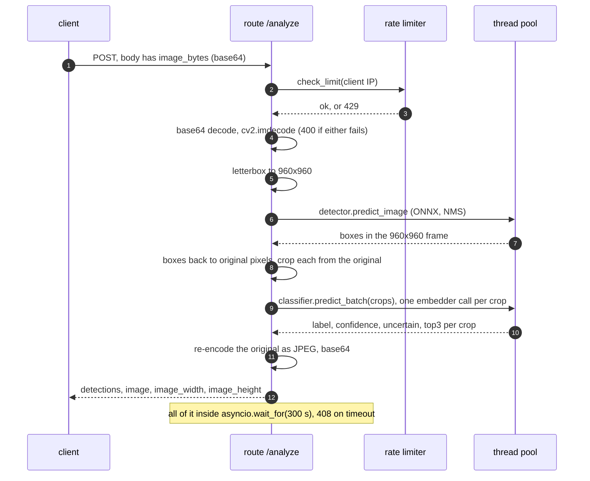
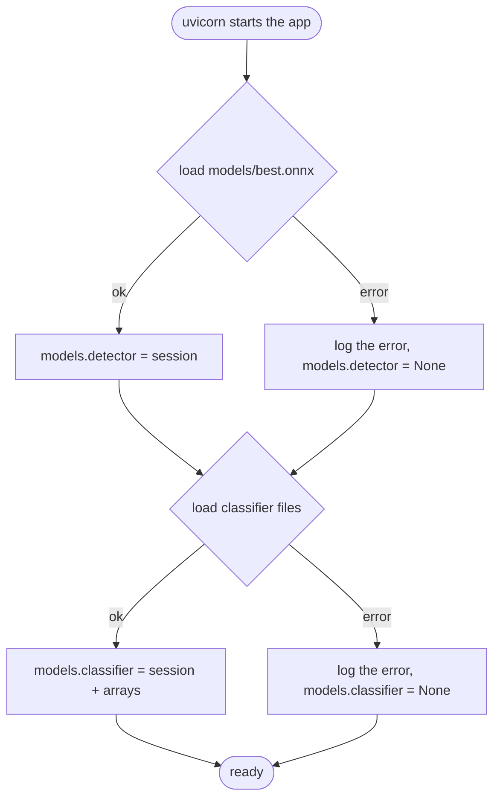

# Architecture

How one photo becomes a list of fish with a diagnosis hint each, which file does what, and what happens when something is missing or slow. Everything here was read from the code and, where stated, run on 2026-10-04 (see [examples/transcripts/](examples/transcripts/)). Why the pieces look like this is in [design-decisions.md](design-decisions.md); every route in detail is in [api.md](api.md).

- [Files](#files)
- [One `/analyze` request](#one-analyze-request)
- [Coordinate frames](#coordinate-frames)
- [Preprocessing, step by step](#preprocessing-step-by-step)
- [Model files and their contract](#model-files-and-their-contract)
- [Start-up and degraded states](#start-up-and-degraded-states)
- [Concurrency, timeouts, limits](#concurrency-timeouts-limits)
- [Failure modes](#failure-modes)

## Files

| Path | Role |
|---|---|
| `main.py` | FastAPI app; `lifespan` loads the two models one after the other, each in its own `try`; open CORS; `python main.py` is broken (see [limitations](../README.md#limitations)), start with `uvicorn main:app` |
| `api/endpoints.py` | routes `/`, `/health`, `/model-status`, `/test`, `/detect`, `/analyze`; input decoding, the 300 s timeout, assembling the answer |
| `api/rate_limiter.py` | per-client-IP sliding window in memory; one global instance built from the settings |
| `inference/detector.py` | `YOLO_ONNX_Inference`: preprocessing, ONNX session, confidence filter, NMS, drawing helper |
| `inference/classifier.py` | `DinoV2Classifier`: crop preprocessing, batched ONNX embedder, NumPy linear head, confidence gate |
| `utils/img.py` | `letterbox_resize`, `unletterbox_bbox`, `crop_by_bbox`, `encode_image_to_base64` (plus drawing helpers the routes do not use) |
| `core/config.py` | `Settings` (pydantic-settings, `.env`); most fields are not read anywhere ([table](../README.md#configuration)) |
| `core/model_loader.py` | `load_detector()` and `load_classifier()`; the models directory is the constant `MODELS_DIR = "./models"` |
| `core/globals.py` | the dictionary `models` that the routes read (`detector`, `classifier`; `None` when a load failed) |
| `models/` | where the files the service loads go ([contract](#model-files-and-their-contract)); none are in the repository |
| `tests/` | 69 tests on stand-in models ([README](../README.md#tests-and-quality)) |
| `docs/examples/` | stand-in model builder, probe and latency scripts, walkthrough, photos, transcripts |

## One `/analyze` request

`/detect` is the first half of this: it takes a multipart upload (`image`), runs the same letterbox and detector, and returns the boxes plus a copy of the photo with the boxes drawn. It calls the detector **inside the event loop** (not in the thread pool), so while it runs (about 0.26 to 0.29 s per photo on the test machine, [latency](examples/transcripts/latency.txt)) the process answers nothing else, `/health` included: with 8 `/detect` requests in flight only 4 health checks completed, the median taking 283 ms and the slowest 1.6 s, against 1.7 ms when idle; during 8 `/analyze` requests 65 completed, median 17 ms ([measurement](examples/transcripts/health-under-load.txt)).

## Coordinate frames

Three pixel frames are involved, and the answer always uses the third:

1. **Decoded photo** (`image_width` × `image_height` in the answer). `cv2.imdecode` applies the EXIF orientation, so a file stored as 200×100 with orientation 6 is decoded as 100 wide and 200 high (checked). The returned `image` is this decoded picture re-encoded without EXIF, so it is upright and boxes match it exactly.
2. **Letterbox canvas**, 960×960: the photo scaled by `min(960/w, 960/h)` (rounded), centred, white padding.
3. The detector's output lives in the canvas frame; `unletterbox_bbox` subtracts the offsets, divides by the scale and clips to the photo.

Worked example, the 1920×1080 photo of the tests: scale 0.5, the picture occupies 960×540, centred, so `x_offset = 0` and `y_offset = 210`. A box centred at (480, 480), 200×100 in the canvas is `[760, 440, 1160, 640]` in photo pixels ([test](../tests/test_detector.py)). A box that lies entirely in the padding is clipped to a line (`y1 == y2`); `/detect` still returns it, `/analyze` cannot crop it and drops it, so `/analyze` can return fewer detections than `/detect` for the same photo ([test](../tests/test_api.py)).

## Preprocessing, step by step

**Detector** (`utils/img.py`, `inference/detector.py`)

| Step | What | Code |
|---|---|---|
| decode | BGR, 8 bit | `cv2.imdecode(..., IMREAD_COLOR)` |
| letterbox | scale to fit 960×960, white (255) padding | `letterbox_resize` |
| model input | BGR→RGB, ÷255, CHW, batch of 1; the detector's own letterbox step runs on the already-square canvas and changes nothing (scale 1, offset 0; its grey 114 padding is never used) | `YOLO_ONNX_Inference.preprocess` |
| output | `(1, 5, 18900)` at 960×960: centre x, centre y, width, height, score for 18900 anchors (one class, so no class scores) | `postprocess` |
| filter | score > 0.25 | `conf_thres` in `core/model_loader.py` |
| NMS | greedy, IoU threshold 0.45 | `nms` |
| result | `bbox` (xyxy, floats), `confidence`, `class_id` always 0 | |

**Classifier** (`inference/classifier.py`), per crop

| Step | What |
|---|---|
| crop | `crop_by_bbox` from the **original** photo (integer pixel coordinates, no extra margin); empty crops are skipped |
| to RGB, square | pad the shorter side to a square, centred, with the neutral colour (124, 116, 104) (the same constant as in the training code of `Defish-ML-train`) |
| resize | 224×224 with Pillow's bicubic filter (`PIL.Image.BICUBIC`), as in the training script and the reference runtime (OpenCV's `INTER_CUBIC` was used before: [decision 6](design-decisions.md#6-onnx-runtime-and-numpy-only-and-the-same-preprocessing-as-training)); ÷255, CHW |
| mirror pair | for each crop a batch of 2: the crop and its horizontal mirror image, tensor `(2, 3, 224, 224)` |
| embedder | **one** ONNX Runtime call per crop (not one for all crops: that was measured 1.3 to 1.9 times slower, [decision 5](design-decisions.md#5-calling-the-embedder-once-per-crop)); the exported graph holds the ImageNet normalisation and the pooling (per `Defish-ML-train/experiments/classifier/export_onnx.py`: CLS token and mean of the patch tokens, 1536 numbers) |
| average | embedding of a crop = mean of the embeddings of the crop and its mirror image |
| head | L2 normalisation, `(x - scaler_mean) / scaler_scale`, `x @ lr_coef.T + lr_intercept`, softmax over the classes |
| result | `label` (arg max), `confidence` (its probability), `uncertain` (`confidence < confidence_threshold`), `top3` (labels and probabilities) |

## Model files and their contract

The service loads these from `./models` relative to the working directory (`MODELS_DIR`; the `model_path` setting is not read). A missing or unreadable file makes **that** model fail at start-up; nothing is retried afterwards.

| File | Used by | Contract |
|---|---|---|
| `models/best.onnx` | detector | input `images` float32 `[batch, 3, height, width]` (RGB, 0..1; 960×960 is used), output `output0` float32 `[batch, 5, anchors]` (YOLOv8-style, one class). The file used for the recordings (not in the repository) carries this metadata: Ultralytics 8.4.157, task `detect`, `imgsz` 960, names `{0: 'fish'}`, licence AGPL-3.0 |
| `models/disease_classifier/meta.json` | classifier | `classes` (the order of the head's rows), `confidence_threshold` (0.83), `onnx_embedder` (file name); the committed file records the cross-validated accuracy (0.572 ± 0.036, top-3 0.841), `n_train_crops` 138 and 5 external "silver" healthy crops |
| `models/disease_classifier/<onnx_embedder>` | classifier | input: the first input of the graph, float32 `[batch, 3, 224, 224]` in 0..1 RGB; output: `[batch, D]`; the real file is `embedder_dinov2_base.onnx` (348 MB with its `.onnx.data`, per `meta.json`) |
| `models/disease_classifier/head_numpy.npz` | classifier | arrays `scaler_mean`, `scaler_scale` (`[D]`), `lr_coef` (`[classes, D]`), `lr_intercept` (`[classes]`) |

The classifier files are produced by `Defish-ML-train` (`train_final.py`, `export_onnx.py`, `finalize_onnx_artifacts.py`) from data that is not public. For development without them, [examples/make_standin_models.py](examples/make_standin_models.py) writes files with this exact contract and no knowledge of fish.

## Start-up and degraded states

The two loads are independent (they used to share one import, so a missing classifier file also left the detector unloaded: [before and after](examples/transcripts/fixes-before-after.txt)).

| detector | classifier | `/health` | `/detect` | `/analyze` |
|---|---|---|---|---|
| loaded | loaded | `"status": "healthy"` | works | works |
| loaded | missing | `"degraded"`, `"classifier": "failed"` | works | 500 `Classifier model not loaded` |
| missing | loaded | `"degraded"`, `"detector": "failed"` | 500 `Detector model not loaded` | 500 `Detector model not loaded` |
| missing | missing | `"degraded"` | 500 | 500 |

`/health` answers HTTP 200 in every row (the caller has to read the fields); `Defish-backend` passes the text through unchanged.

## Concurrency, timeouts, limits

- **Threads.** `/analyze` runs the detector and the classifier with `run_in_threadpool`, so the event loop stays free; `/detect` does not (above). ONNX Runtime uses its default thread count per session. One uvicorn process in the Dockerfile and the compose file; nothing caps the number of concurrent `/analyze` requests (`max_concurrent_requests` in the settings is not read).
- **Timeout.** `REQ_TIMEOUT = 300` seconds (constant in `api/endpoints.py`, not configurable) via `asyncio.wait_for`; HTTP 408. The wait is abandoned, but the work already handed to a thread is not interrupted and keeps using CPU until it finishes. `Defish-backend` calls with a 180 s timeout, so it gives up before the service does; raise it where analyses take longer (a 2-core VDS needed 171.6 s for 29 fish).
- **Rate limit.** Per client IP as seen by the server (`request.client.host`: behind a reverse proxy on another host all clients share one key, because uvicorn rewrites the address from `X-Forwarded-For` only for peers listed in `--forwarded-allow-ips`, by default 127.0.0.1; the code itself never reads that header), sliding window, in the memory of one process: default 60 requests per 60 s, counted for `/detect` and `/analyze` (also for the requests that fail validation), not for the other routes. `Defish-backend` is a single client for this service: its workers share one address, so it shares one allowance (with the previous default of 5 per minute it could run only five analyses a minute, any more were answered with 429); the worker treats any status other than 200 as a failed analysis (`Defish-backend/worker.py`, read, not run against this service).
- **Cost per request** (measured with the real files, one process, 16 threads): `/detect` about 0.28 s; `/analyze` about 0.28 s plus 0.2 to 0.3 s per fish (3.2 s for 11 fish, 5.4 s for 29, 12.5 s for 46; before the change of 2026-10-05: 4.3, 11.5 and 18.8 s); one embedder pass of one image is about 131 ms and a crop needs two ([measurements](examples/transcripts/classifier-measurements.txt)).
- **Memory.** The photo is decoded fully; the answer carries the photo again as base64 JPEG (OpenCV's default quality, 95), which is about a third larger than the JPEG bytes.

## Failure modes

| Situation | Answer |
|---|---|
| `/analyze` body is not JSON, has no `image_bytes`, or it is not a string / not valid base64 | 400 `Body must be JSON with a base64 string in 'image_bytes'` |
| bytes do not decode as an image (also an empty buffer) | 400 `Cannot decode image` |
| `/detect` upload without the `image` field | 422 (FastAPI validation body) |
| `/detect` upload whose content type is not `image/*` | 400 `Uploaded file must be an image` |
| more than the limit in the window | 429 `{"detail": {"error": "Too many requests", "retry_after": s, "limit": n, "window": s}}` |
| a needed model is not loaded | 500 with the reason (table above) |
| anything else unexpected inside the handler | 500 `Detection failed` (the exception text goes to the log, not to the client) |
| processing takes longer than 300 s | 408 `Processing timeout. Image might be too large.` |

All of these except the 408 on a real photo are covered by tests or recorded in the transcripts; the 408 is covered by a test with a shortened timeout and a slowed detector.
